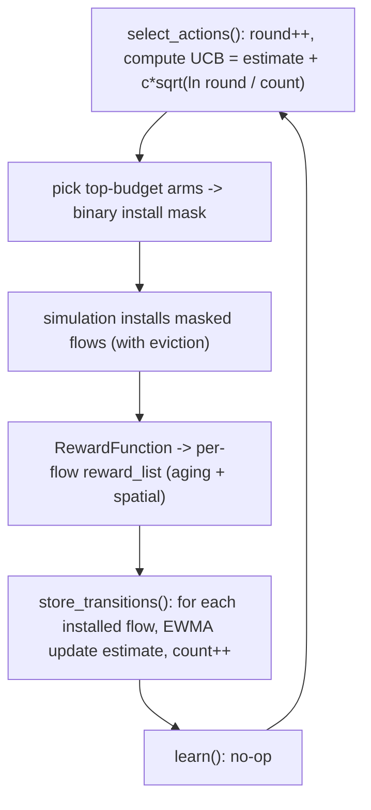

# Combinatorial Bandit Implementation (`--algorithm bandit`)

This document explains `CombinatorialBanditLearner` in
`code/core/combinatorial_bandit.py` in depth. It assumes you know the DQN
learner (see `docs/dqn_implementation.md`) and constantly contrasts against it,
since that is the easiest way in.

---

## 1. The big mental shift from DQN

DQN asks: *"Given a state, what is the value of each of my `2^k` possible
actions, and which has the highest value?"* It is **value-based**, **deep**, and
**multi-agent**, and it tries to solve a (degenerate) sequential MDP.

The combinatorial bandit asks a much simpler question: *"Each flow is a slot
machine arm with some unknown average payoff. Which subset of arms should I pull
this round to maximize reward, given what I've learned so far?"*

Consequences of that shift:

| Aspect | DQN | Combinatorial Bandit |
| --- | --- | --- |
| Has a neural network? | yes | **no** — just two NumPy arrays |
| What it learns | Q-values `Q(s, a)` | one running mean reward **per flow** |
| Action representation | integer in `2^k` per agent | a binary mask over all flows, chosen directly |
| Exploration | epsilon-greedy (random actions) | **UCB optimism** (a confidence bonus) |
| Uses the "state"? | yes (as net input) | **ignored entirely** |
| Sequential reasoning (`gamma`) | yes (`max Q(next)`) | none — pure one-shot per round |
| Uses `reward_list`? | no (uses `agent_rewards`) | **yes — this is the whole point** |

The bandit is the "honest" model of this problem: there is no meaningful state,
the reward function already hands us **one reward per flow**
(`reward_list`, semi-bandit feedback), and the decision is simply *which flows
to install*. The bandit consumes exactly that structure.

---

## 2. The two pieces of memory

`code/core/combinatorial_bandit.py` lines 23-45.

For `num_flows = 25` the entire "model" is:

```python
self.estimates = np.zeros(25)   # estimates[i] = running mean reward of flow i
self.counts    = np.zeros(25)   # counts[i]    = how many times flow i has been installed+observed
self.round     = 0              # how many rounds (LTIs) have elapsed
```

That is it. Compare to DQN, which holds 3 evaluation networks, 3 target
networks, and 3 replay buffers. The bandit holds two length-25 vectors.

Configuration read from args:

- `self.c` (`--bandit_c`, default 1.0): the exploration constant.
- `self.reward_aging_factor` (`--rewardAgingFactor`, default 0.95): reused as
  the decay in the running-mean update (explained in §5).
- `self.budget = min(tablesize, num_flows)`: how many arms to "pull" (install)
  each round. With `--tablesize 10` and 25 flows, `budget = 10`.

---

## 3. How it chooses flows: UCB (`_ucb_scores` + `select_actions`)

`code/core/combinatorial_bandit.py` lines 47-73.

### 3.1 The UCB score
For each flow `i`, compute an **upper confidence bound** on its true mean
reward:

```
score_i = estimate_i + c * sqrt( ln(round) / counts_i )
          \_________/   \_____________________________/
           what we know        the "optimism bonus"
```

- `estimate_i` is exploitation: the best current guess of flow `i`'s payoff.
- The bonus is exploration: it is **large when `counts_i` is small** (we are
  uncertain about that flow) and shrinks as we observe a flow more often. `c`
  scales how aggressively we explore.
- **Never-pulled flows (`counts_i == 0`) get `score = +inf`** (lines 52-53), so
  every flow is guaranteed to be tried before any flow is tried twice.

This is the elegant part: UCB *automatically* balances explore vs exploit
without a hand-tuned schedule. Contrast DQN's epsilon, which explores by taking
**uniformly random** actions and must be manually decayed from 1.0 to 0.01. UCB
instead explores **the specific arms it is most unsure about**.

### 3.2 Selecting the subset
`select_actions` (lines 59-73):

```python
self.round += 1
scores = self._ucb_scores()
selected = np.argpartition(scores, -self.budget)[-self.budget:]  # indices of top `budget` scores
action = np.zeros(num_flows, int)
action[selected] = 1                                             # binary install mask
```

It picks the `budget` (=10) highest-scoring flows and returns a length-25 binary
mask. `convert_actions_to_binary` (lines 75-77) is the identity — the mask is
already the install decision, exactly like PPO and unlike DQN's bit-expansion.

> Why top-`budget` and not "all flows above a threshold"? Because only
> `tablesize` flows can physically live in the switch table. Selecting the
> `tablesize` most promising arms each round is the natural budget constraint of
> a combinatorial bandit. The simulation's install logic still applies eviction
> rules on top of this.

---

## 4. How it observes outcomes: `store_transitions`

`code/core/combinatorial_bandit.py` lines 79-94.

This is where "semi-bandit feedback" matters. The reward function returns a
**per-flow** reward vector `reward_list` (length 25). The bandit updates only
the arms it actually pulled:

```python
for i in range(num_flows):
    if action[i] == 1:                       # only flows we installed this round
        estimates[i] = aging * estimates[i] + (1 - aging) * reward_list[i]
        counts[i]   += 1
```

Two things to note:

1. Only **selected** arms are updated. Flows we did not install give us no new
   information about their payoff (that is the "semi-bandit" model — we see the
   reward of each pulled arm, not the unpulled ones).
2. `learn()` is a **no-op** (lines 96-98). Unlike DQN, where `learn()` does the
   heavy Bellman update, the bandit has already learned everything online inside
   `store_transitions`. There is no batch, no backprop, no gradient.

---

## 5. The running-mean update and `rewardAgingFactor`

The update on line 93 is an **exponential moving average (EWMA)**:

```
estimate_i  <-  aging * estimate_i  +  (1 - aging) * reward_i
```

with `aging = rewardAgingFactor = 0.95` by default.

- If you used a plain average, every observation would count equally forever.
  Old traffic patterns would dominate long after they stopped being relevant.
- The EWMA instead **down-weights old observations geometrically**: the most
  recent reward gets weight `1 - aging = 0.05`, the previous one `0.05*0.95`,
  the one before `0.05*0.95^2`, and so on. The estimate "forgets" stale
  behavior and tracks the current traffic — which is exactly the spirit of the
  `rewardAgingFactor` in the DQN reward pipeline (where `accumulated_reward` is
  decayed by the same factor in `RewardFunction`).

So `rewardAgingFactor` shows up in **two** places for the bandit, both with the
same intent (aging old reward signal):

1. Inside `RewardFunction`, on the shared `accumulated_reward` (same as DQN/PPO).
2. Inside the bandit's per-arm EWMA estimate (bandit-specific).

`spatialReward` is also honored automatically, because the spatial bonus is
already baked into the `reward_list` values the bandit consumes.

---

## 6. Full worked example (num_flows = 6, budget = 3, c = 1.0, aging = 0.95)

A small instance so the numbers are tractable.

**Round 1.** `round` becomes 1, `ln(1) = 0`. All `counts` are 0, so every score
is `+inf`. `argpartition` picks 3 arms (ties → arbitrary, say flows 0,1,2):

```
action = [1,1,1,0,0,0]
```

Suppose the reward function returns `reward_list = [2.0, 0.0, 1.0, 5.0, 0.0, 0.0]`.
We update only the pulled arms (0,1,2):

```
estimate[0] = 0.95*0 + 0.05*2.0 = 0.100   count[0]=1
estimate[1] = 0.95*0 + 0.05*0.0 = 0.000   count[1]=1
estimate[2] = 0.95*0 + 0.05*1.0 = 0.050   count[2]=1
# flows 3,4,5 untouched: estimate=0, count=0
```

(Notice flow 3 had the biggest reward, 5.0, but we did not install it this
round, so we learned nothing about it — semi-bandit feedback.)

**Round 2.** `round` becomes 2, `ln(2) ≈ 0.693`. Flows 3,4,5 still have
`count = 0` → score `+inf`; flows 0,1,2 have finite scores. So the top-3 are
exactly the unpulled flows 3,4,5:

```
action = [0,0,0,1,1,1]
```

Suppose `reward_list = [0,0,0, 6.0, 1.0, 0.0]`. Update arms 3,4,5:

```
estimate[3] = 0.05*6.0 = 0.300   count[3]=1
estimate[4] = 0.05*1.0 = 0.050   count[4]=1
estimate[5] = 0.05*0.0 = 0.000   count[5]=1
```

After round 2 every arm has been tried once. From round 3 onward there are no
more `+inf` scores, so selection becomes a genuine explore/exploit trade-off.

**Round 3.** `round` becomes 3, `ln(3) ≈ 1.099`. Each arm now has `count = 1`,
so the bonus is `1.0 * sqrt(1.099 / 1) ≈ 1.048` for all of them — equal bonus,
so ranking is by `estimate`:

```
scores ≈ estimate + 1.048
flow 3: 0.300 + 1.048 = 1.348   <- highest
flow 0: 0.100 + 1.048 = 1.148
flow 2: 0.050 + 1.048 = 1.098
flow 4: 0.050 + 1.048 = 1.098
flow 1: 0.000 + 1.048 = 1.048
flow 5: 0.000 + 1.048 = 1.048
```

Top-3 → flows 3, 0, 2 get installed. The bandit has correctly started favoring
flow 3 (the high earner) while still keeping enough bonus to revisit others.
Over many rounds, well-performing flows accumulate higher `estimate`, and
rarely-tried flows periodically resurface via the growing `ln(round)` bonus.

---

## 7. Lifecycle diagram



Compare with DQN, where the analogous loop would have a replay-buffer write, a
gated minibatch sample, a target-network sync, and a gradient step in place of
the single EWMA line.

---

## 8. The interface no-ops (why they exist)

The bandit implements the full learner interface so it is a drop-in, but several
methods are trivial because the bandit has no neural network and no epsilon:

- `learn()` → `return` (online update already done).
- `decay_epsilon_for_all_agents()` → `return` (UCB self-regulates exploration).
- `get_average_epsilon()` → `0.0`.
- `num_states` / `num_actions` are set to `num_flows` only so the simulation's
  `current_state = torch.zeros(num_states)` sizing works; the bandit never reads
  the state.

---

## 9. Relevant CLI parameters

Bandit-only:

| Flag | Default | Meaning |
| --- | --- | --- |
| `--bandit_c` | 1.0 | UCB exploration constant (higher = more exploration) |

Reused (with bandit-specific meaning):

| Flag | Role in the bandit |
| --- | --- |
| `--rewardAgingFactor` | EWMA decay on per-arm estimates |
| `--tablesize` | sets the per-round install budget |
| `--numberofFlowsPerAgent` | stored for interface parity; not used for decisions |

There is **no** learning rate, no network size, no replay buffer, and no epsilon
schedule — none of those concepts exist for this learner.

---

## 10. Strengths and weaknesses

- Strength: it matches the true structure of the problem (subset selection with
  per-arm feedback), has almost no hyperparameters, no neural net, and is
  extremely cheap and interpretable. `estimate_i` is literally "how good flow
  `i` has been lately."
- Strength: UCB gives principled, automatic exploration with regret guarantees
  in the classical setting — no fragile epsilon tuning.
- Weakness: it is **context-free**. It cannot condition its decision on any
  observed feature; it only tracks marginal per-flow averages. If flow value
  depended on a rich state, a deep method (PPO) could in principle exploit that
  — but recall the state here is degenerate, which is precisely why the bandit
  is so competitive.
- Weakness: it treats arms independently, ignoring correlations between flows
  (a "linear" or "contextual" combinatorial bandit could model those).
